# Dokumentasi Fitur Sellora (Toko Online), Kelompok 4
Nama :
  1. Yoga Perkasa Didik (103072400106)
  2. Valen Jonathan Miceliano Pasaribu (103072400072)

## Daftar Isi
1. [Class Diagram](#class-diagram)
2. [Fitur](#fitur)
3. [Akun dummy & Percobaan](#akun)

# Class Diagram
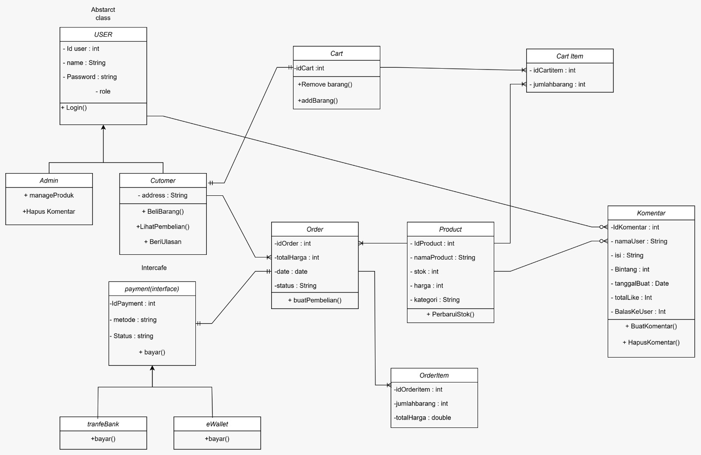

# Fitur
## 1. Ulasan Produk (Yoga)
- **Controller & Service terkait:** `CProductDetail` & `SProductDetail`
  - **Kegunaan:** Menampilkan umpan balik (*rating* atau komentar) dari pelanggan terhadap suatu barang.
  - **Logic:** Biasanya fitur ini di-integrasikan saat menampilkan detail produk. Service akan mengambil data utama dari Entity `Product` sekaligus menarik data ulasan yang relevan dari *database* untuk disajikan di antarmuka halaman barang, sehingga calon pembeli lain dapat melihatnya.
  -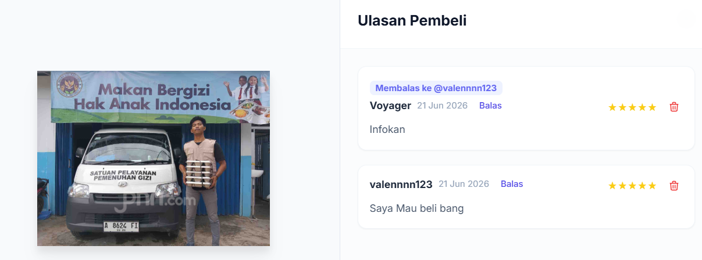

## 2. Search Produk (Yoga)
- **Controller & Service terkait:** `Cfilter` / `CDashboard` & `Sfilter` / `SDashboard`
  - **Kegunaan:** Memudahkan pengguna atau Admin menemukan barang tertentu cukup dengan mengetikkan nama/kata kunci.
  - **Logic:** *Method* pencarian menerima inputan teks dari kolom *search bar*. Service lalu melakukan pencarian dinamis (misalnya memakai `LIKE %keyword%`) pada Entity `Product`, dan hanya mengembalikan produk yang namanya mengandung unsur kata pencarian tersebut.
  - Mainpage
  - 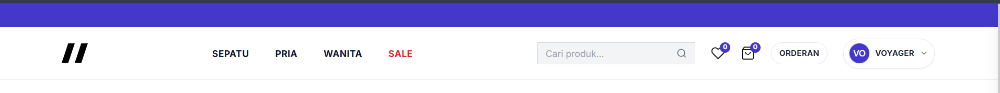
  - Dashboard
  - 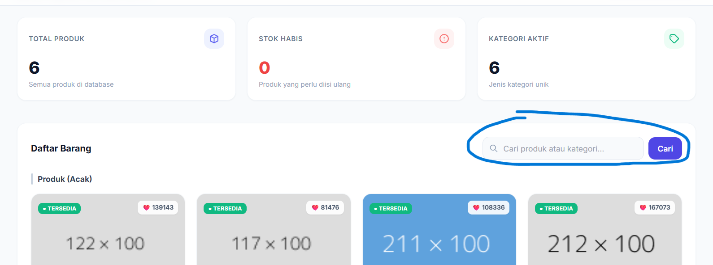

## 3. Filter Produk (Yoga)
- **Controller & Service terkait:** `Cfilter` & `Sfilter`
  - **Kegunaan:** Menyaring etalase toko agar hanya menampilkan produk sesuai kategori tertentu (misalnya, hanya kategori *Elektronik* atau *Baju*).
  - **Logic:** `Sfilter` menerima parameter kategori yang diklik pengguna. Daripada memuat seluruh barang, *method* ini akan secara spesifik me-*request* daftar dari Entity `Product` yang cocok dengan kategori yang diminta, menghemat waktu proses dan memudahkan belanja.
  - 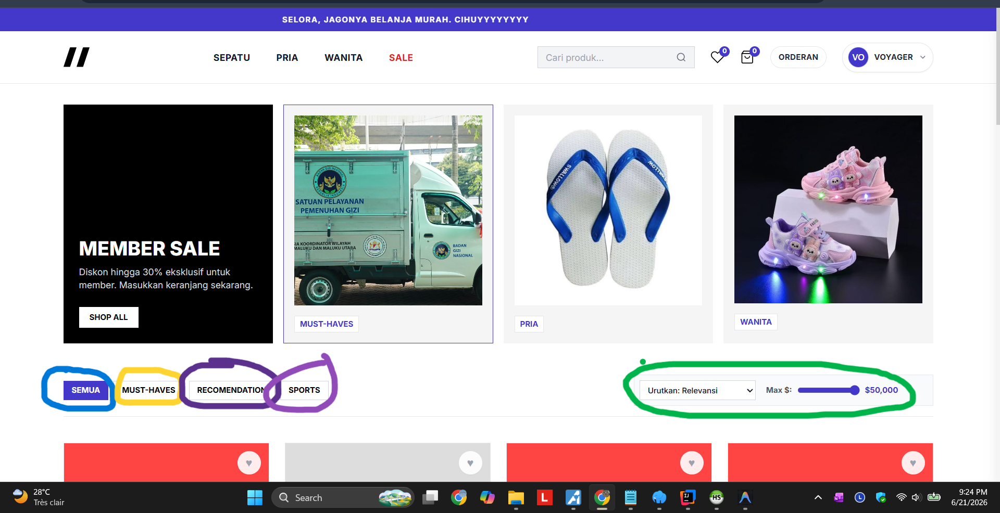

## 4. Pembelian (Checkout) (Valen)
- **Controller & Service terkait:** `CCheckout` & `SCheckout`
  - **Kegunaan:** Mengurus proses "bayar sekarang" untuk barang-barang yang sudah dimasukkan ke keranjang.
  - **Logic:** Ini adalah fitur inti transaksi. Saat dieksekusi, `SCheckout` menjumlahkan total harga belanjaan, memotong jumlah stok persediaan dari Entity `Product`, lalu memigrasikan data barang dari Entity `Cart` menjadi struk belanja permanen di Entity `Order` dan `OrderItems`. Begitu proses ini sukses, keranjang pengguna langsung dikosongkan.
  - 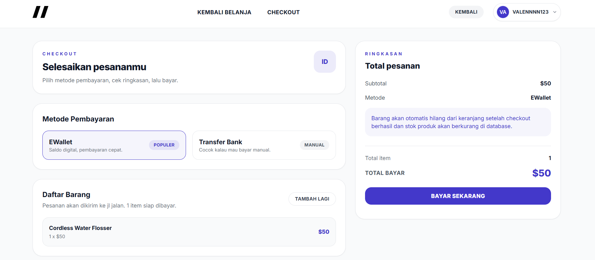

## 5. Fitur Keranjang (Add to Cart) (Valen)
- **Controller & Service terkait:** `CAddKeranjang` & `SAddKeranjang`
  - **Kegunaan:** Menampung sementara barang-barang yang rencananya akan dibeli oleh *user*.
  - **Logic:** Saat pengguna menekan "Tambah Keranjang", `SAddKeranjang` akan memverifikasi ketersediaan stok terlebih dahulu, barulah menyimpannya ke Entity `Cart`. Khusus di sini, ada penanganan spesial menggunakan `CartExceptionHandler` pada Controller, agar pesan *error* (misalnya kalau stok tidak muat atau *user* lupa login) tampil rapi di layar pengguna.
  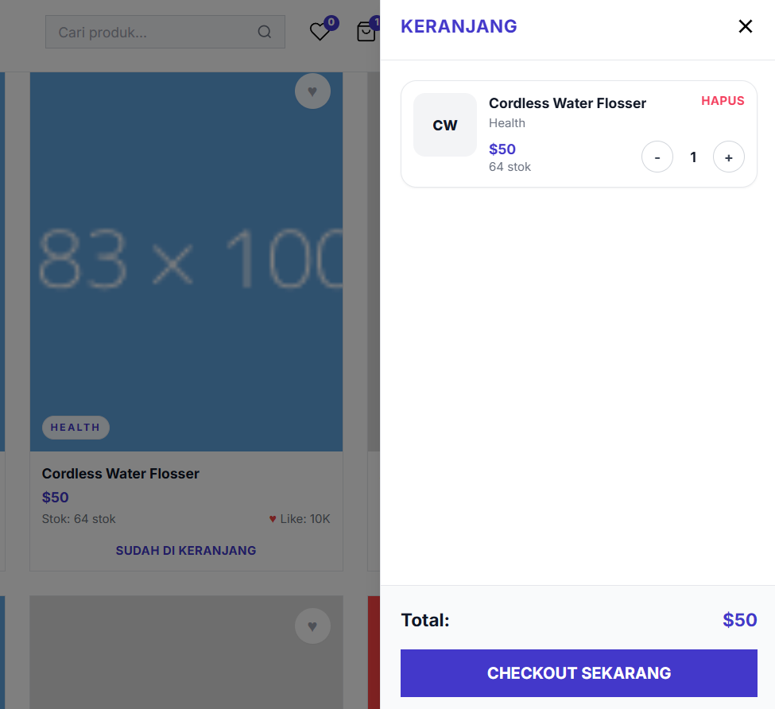

## 6. Login (Valen)
- **Controller & Service terkait:** `CLogin` & `SLogin`
  - **Kegunaan:** Pintu masuk keamanan sistem. Mengatur autentikasi pengguna agar bisa mulai bertransaksi atau mengakses *dashboard* (khusus Admin).
  - **Logic:** `SLogin` bertugas melacak kecocokan email di Entity `User` dan mengecek perizinan akses di Entity `Role`. Demi keamanan tingkat tinggi, *password* asli tidak pernah dicocokkan secara mentah, melainkan wajib melalui validasi kecocokan enkripsi algoritma **BCrypt**. Jika valid, akses diberikan.
  - 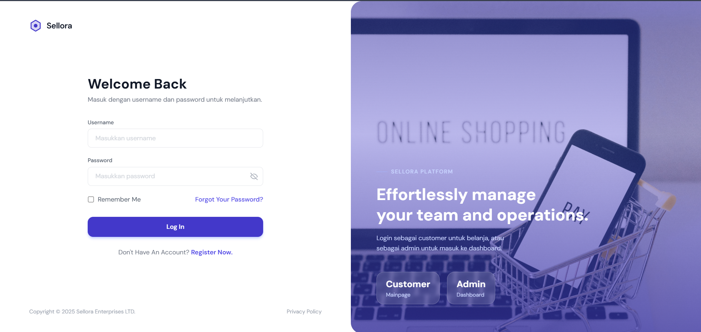

## 7. Register (Valen)
- **Controller & Service terkait:** `CRegister` & `SRegister`
  - **Kegunaan:** Tempat di mana pengunjung bisa mendaftarkan akun baru agar resmi menjadi pengguna terdaftar.
  - **Logic:** `SRegister` memastikan *email* tersebut belum pernah dipakai. Setelah itu, *password* yang diketik pengguna tidak disimpan polos; *method* ini akan meng-*hash* *password* tersebut dengan **BCrypt**, barulah menyimpannya ke dalam *database* sebagai Entity `User` baru (dengan tipe peran *default* sebagai pembeli biasa/Customer).
  - 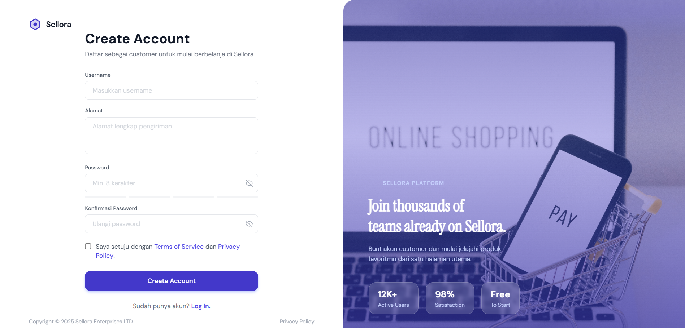

## 8. Add Barang (Tambah Produk & Upload Gambar) (Yoga)
- **Controller & Service terkait:** `CDSupaimg` & `SDsupaimg`
  - **Kegunaan:** Fitur yang digunakan oleh Admin untuk menjual barang baru, lengkap dengan rincian dan foto barangnya.
  - **Logic:** `SDsupaimg` memiliki alur kerja ganda: menerima data teks (nama, harga, kategori) sekaligus mengolah *file* foto yang diunggah. Gambar akan disimpan dengan aman ke dalam *storage* lokal (direktori proyek), dan detail teksnya direkam rapat-rapat ke dalam Entity `Product`.
  - 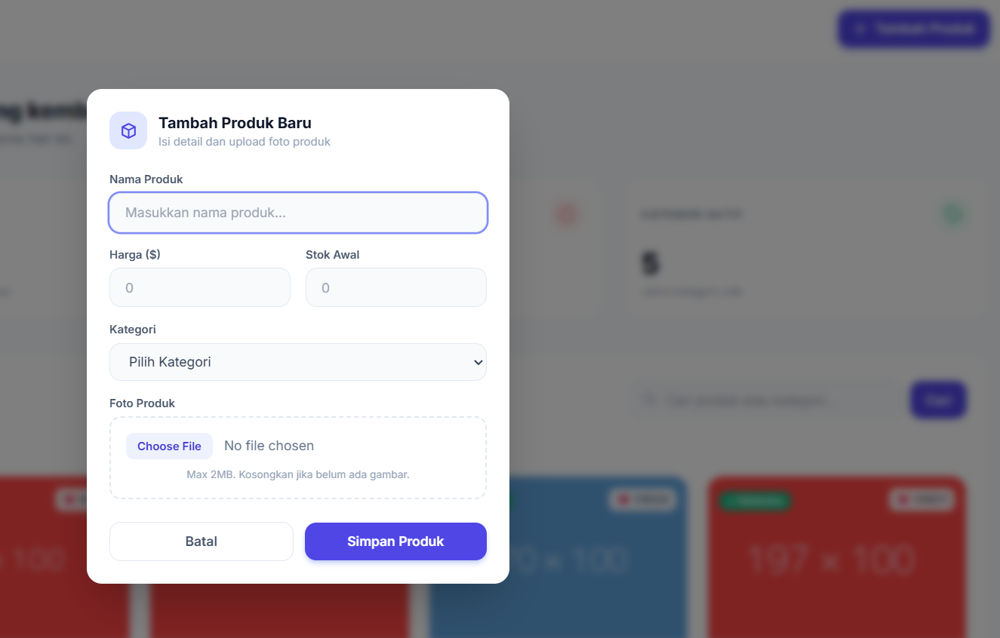

## 9. Add Stok Barang & Mengurangi (Update Stock) (Yoga)
- **Controller & Service terkait:** `CDashboard` & `SDashboard`
  - **Kegunaan:** Membantu Admin mengatur sirkulasi barang secara instan, seperti menambah stok saat barang baru tiba, atau menguranginya jika barang rusak.
  - **Logic:** Menggunakan mekanisme *PATCH mapping*, Admin cukup memasukkan seberapa banyak stok ingin ditambah (atau dikurangi dengan memakai angka minus). Service akan mencari Entity `Product` berdasarkan ID-nya, mengalkulasi jumlah stok barunya, dan langsung menimpanya di *database*.
  - 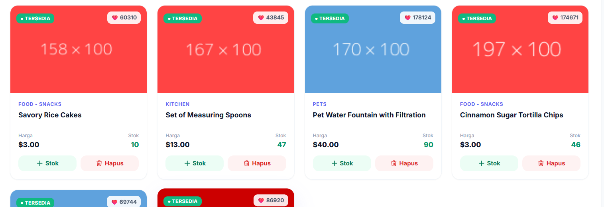

## 10. Delete Barang (Yoga)
- **Controller & Service terkait:** `CDhapus` / `CDashboard` & `SDhapus`
  - **Kegunaan:** Membuang produk selamanya dari sistem apabila sudah tidak lagi diproduksi atau dijual.
  - **Logic:** Fitur sederhana namun sangat berdampak. `SDhapus` akan memanggil perintah *delete* langsung ke *database* berdasarkan ID spesifik, merobohkan rekaman data di Entity `Product` agar produk itu tidak pernah muncul lagi di halaman pencarian.

## 11. Cek Order (Manajemen & Riwayat Pesanan) (Yoga)
- **Controller & Service terkait:** `COrder` (untuk *Customer*), `CAdminOrder` (untuk *Admin*) & `Sorder` / `SAdminOrder`
  - **Kegunaan:** Menampilkan resi riwayat apa saja yang sudah dibeli pelanggan, sekaligus tempat di mana Admin mengubah status pengiriman.
  - **Logic:**
    - Pada sisi **Pembeli**, `Sorder` mencari Entity `Order` dan `OrderItems` miliknya secara spesifik.
    - Pada sisi **Admin**, `SAdminOrder` mengambil *semua* pesanan dari seluruh pengguna. Datanya diurutkan secara sekuensial (misalnya berdasar ID yang terus *Ascending*) agar rapi. Admin juga dapat mengaktifkan fungsi edit status, yang mana hal itu akan langsung mengubah entri status (*Diproses*, *Dikirim*, dll.) di dalam Entity `Order` yang sama.
    - 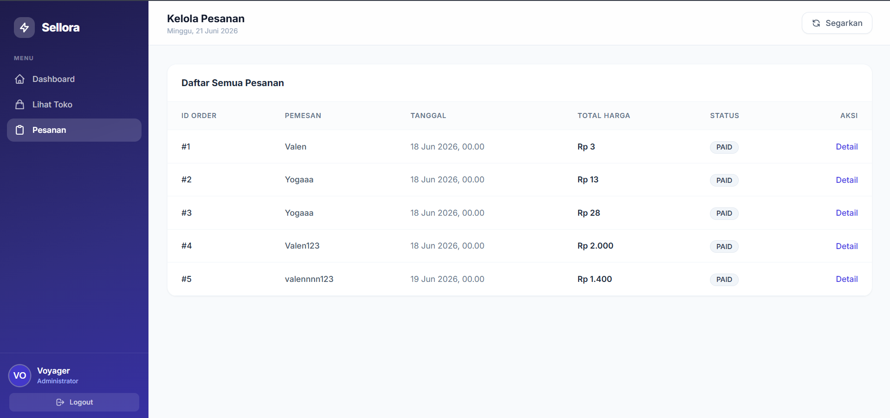

## 12. Keamanan & Konfigurasi Sistem (Security, Interceptors & WebConfig) (Kami berdua)
Fitur-fitur utama di atas dilindungi dan diatur oleh lapisan keamanan dan konfigurasi tambahan agar berjalan dengan aman dan efisien:

- **Enkripsi Kata Sandi (BCrypt)**
  - **Fungsi Utama:** Melindungi privasi dan keamanan pengguna agar kata sandi tidak bocor meskipun *database* terekspos.
  - **Cara Kerja:** Kami menggunakan *library* BCrypt. Ketika pengguna melakukan registrasi, *password* teks biasa akan diubah menjadi deretan teks acak (di-*hash*). Saat pengguna login, sistem tidak akan membaca ulang kata sandi aslinya, melainkan mencocokkan *input* baru dengan *hash* yang tersimpan (keduanya harus menghasilkan *hash* yang ekuivalen).
  
- **Interceptor (AdminInterceptor, dll.)**
  - **Fungsi Utama:** Menjadi satpam penjaga pintu depan sebelum *request* mencapai Controller.
  - **Cara Kerja:** Sebelum fitur krusial (seperti *Dashboard Admin* atau *Update Stock*) bisa diakses, Interceptor akan menahan *request* API tersebut dan mengecek *header* permintaannya (misalnya mengecek `X-User-Role`). Jika peran yang mencoba mengakses bukanlah `ADMIN`, Interceptor akan menolak *request* secara otomatis tanpa perlu membebani Controller. Ini menjaga rute-rute sensitif tetap terlindungi.

- **Konfigurasi Web (WebConfig / CorsConfig)**
  - **Fungsi Utama:** Mendaftarkan jalur lintasan file statis dan mengatur perizinan lintas *domain* (CORS) maupun mendaftarkan *Interceptor*.
  - **Cara Kerja:** Pada kelas konfigurasi (`WebMvcConfigurer`), kami memberitahu Spring Boot di mana letak Interceptor harus dipasang (misalnya hanya di *path* `/api/dashboard/**`). Kelas ini juga mengatur *CORS (Cross-Origin Resource Sharing)*, menentukan dari domain mana saja antarmuka (*frontend*) diizinkan untuk "berkomunikasi" dengan *backend* Spring Boot, serta mengatur pemetaan *folder resource* seperti tempat penyimpanan gambar produk agar dapat diakses dari luar.

# Akun
- Admin
  - Username : Voyager
  - Password : Apainiwok228@

- User Biasa
  - Username : valennnn123
  - Password : halolennnn

[akun]: #Akun